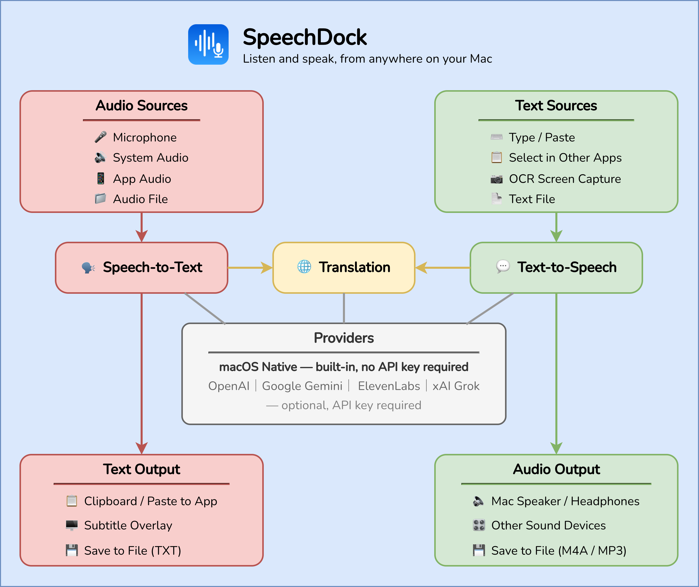

<p align="center">
  
</p>

<p align="center">
  
  
  <a href="LICENSE"></a>
  <a href="https://github.com/yohasebe/speechdock/releases"></a>
  
</p>

## What is SpeechDock?

**Transcribe any audio on your Mac** — Not just your voice through the microphone, but also system-wide audio or sound from a specific app. If your Mac can hear it, SpeechDock can turn it into text in real time.

**Hear any text on your screen** — Selected text, typed text, pasted content, or text captured via OCR from any screen region. If you can see it, SpeechDock can read it aloud.

**Live subtitles and translation** — Display real-time transcription as on-screen subtitles, with optional translation into 100+ languages using on-device or cloud providers.

**Always accessible from your menu bar** — Global hotkeys let you use STT and TTS from anywhere, without switching apps. Works immediately after installation with no API keys required. Cloud providers are optional enhancements.

English | [日本語](README_ja.md)

## Architecture

<p align="center">
  
</p>

## Documentation

| Page | Description |
|------|-------------|
| **[Home](https://yohasebe.github.io/speechdock/)** | Overview and getting started |
| **[Basic Features](https://yohasebe.github.io/speechdock/basics.html)** | macOS native STT/TTS, OCR, subtitles, shortcuts |
| **[Advanced Features](https://yohasebe.github.io/speechdock/advanced.html)** | Cloud providers, API keys, file transcription, translation |
| **[AppleScript](https://yohasebe.github.io/speechdock/applescript.html)** | Scripting commands, properties, examples, error codes |

## Features

### Speech-to-Text (STT)

Convert speech to text using:

| Provider | Models | API Key |
|----------|--------|---------|
| **macOS Native** | System Default (SpeechAnalyzer on macOS 26+) | Not required |
| **OpenAI** | GPT-4o Transcribe, GPT-4o Mini Transcribe, Whisper | Required |
| **Google Gemini** | Gemini 2.5 Flash Native Audio, Gemini 2.0 Flash Live | Required |
| **ElevenLabs** | Scribe v2 Realtime | Required |
| **Grok** | Grok Realtime | Required |

**Note**: On macOS 26+, the native STT uses Apple's new SpeechAnalyzer framework, providing real-time transcription without time limits and improved performance.

### Text-to-Speech (TTS)

Convert text to speech using:

| Provider | Models | API Key |
|----------|--------|---------|
| **macOS Native** | System Default | Not required |
| **OpenAI** | GPT-4o Mini TTS (Dec 2025), GPT-4o Mini TTS, TTS-1, TTS-1 HD | Required |
| **Google Gemini** | Gemini 2.5 Flash TTS, Gemini 2.5 Pro TTS | Required |
| **ElevenLabs** | Eleven v3, Flash v2.5, Multilingual v2, Turbo v2.5, Monolingual v1 | Required |
| **Grok** | Grok Voice | Required |

### OCR to Speech

Capture text from any region of your screen and convert it to speech:

1. Press the OCR hotkey (`Ctrl + Option + Shift + O` by default)
2. Drag to select the region containing text
3. Recognized text appears in the TTS panel for editing
4. Press Speak to read the text aloud

Uses macOS Vision Framework for text recognition. Requires Screen Recording permission.

### Subtitle Mode

Display real-time transcription as subtitles overlay during recording:

- **On-screen subtitles** - Show transcription as floating subtitles anywhere on screen
- **Real-time translation** - Optionally translate subtitles as you speak
- **Customizable appearance** - Adjust font size, opacity, position (top/bottom), and max lines
- **Draggable position** - Drag subtitles to any location on screen
- **Auto-hide panel** - Optionally hide STT panel when subtitle mode is active

Toggle with hotkey (`Ctrl + Option + S` by default) or from the STT panel/menu bar.

### Audio Sources

- **Microphone** - Record from any connected microphone with device selection
- **System Audio** - Capture all audio output from your Mac
- **App Audio** - Capture audio from a specific application

### Quick Transcription

A floating microphone button for instant voice input without opening the STT panel:

1. Enable **Floating Mic Button** from the menu bar
2. Click the button or press `Ctrl + Option + M` to start recording
3. Speak — real-time transcription appears in a floating HUD
4. Click again or press `Ctrl + Option + M` to stop
5. Transcribed text is automatically pasted into the frontmost app

The button can be dragged anywhere on screen, and its position is saved.

### Additional Features

- Global keyboard shortcuts for STT and TTS
- Customizable panel shortcuts with modifier key support
- Panel windows for real-time transcription with paste target selection
- Panel windows for TTS with text editing and word highlighting
- Panel style selection: Floating (always-on-top) or Standard Window
- Audio output device selection for TTS
- Save synthesized audio to file (M4A/MP3 format)
- Language selection for STT and TTS
- Speed control for TTS playback
- Voice and model selection per provider
- VAD (Voice Activity Detection) auto-stop for hands-free recording
- Text replacement rules for STT output correction
- Translation (macOS on-device or cloud LLMs)
- Transcription history (auto-saved, up to 50 entries, accessible from menu bar)
- Text file drag & drop for TTS panel (.txt, .md, .text, .rtf)
- Real-time character and word count display
- Automatic WebSocket reconnection with exponential backoff
- [AppleScript support](docs/applescript.md) for automation
- Automatic updates via Sparkle
- Launch at login option

## Requirements

- macOS 14.0 (Sonoma) or later
- Apple Silicon Mac (M1/M2/M3/M4)
- API keys for cloud providers are **optional** (required only if using OpenAI, Google Gemini, ElevenLabs, or Grok)

## Installation

### Homebrew (Recommended)

```bash
brew tap yohasebe/speechdock
brew install --cask speechdock
```

To update to the latest version:

```bash
brew upgrade --cask speechdock
```

### Manual Download

1. Download the latest `.dmg` file from the [Releases](https://github.com/yohasebe/SpeechDock/releases) page
2. Open the DMG file
3. Drag SpeechDock to your Applications folder
4. Launch SpeechDock from Applications

## Setup

### API Keys

To use cloud providers, you need to configure API keys:

1. Open **Settings** > **API Keys**
2. Enter your API keys:
   - **OpenAI**: [OpenAI Platform](https://platform.openai.com/api-keys)
   - **Google Gemini**: [Google AI Studio](https://aistudio.google.com/apikey)
   - **ElevenLabs**: [ElevenLabs Settings](https://elevenlabs.io/app/settings/api-keys)
   - **Grok (xAI)**: [xAI Console](https://console.x.ai/)

API keys are securely stored in macOS Keychain.

### Permissions

SpeechDock requires or recommends the following permissions:

| Permission | Level | Purpose |
|------------|-------|---------|
| **Microphone** | Required | Speech recognition input |
| **Accessibility** | Recommended | Global keyboard shortcuts and text insertion |
| **Screen Recording** | Optional | System/App Audio capture, OCR, and window thumbnails |

On first launch, SpeechDock displays a permission setup window with real-time status indicators. Grant permissions in **System Settings** > **Privacy & Security** — the setup window updates automatically without restarting the app. Features that require missing permissions are disabled in the UI with clear visual indicators.

## Usage

### Keyboard Shortcuts

| Action | Default Shortcut |
|--------|------------------|
| Toggle STT Panel | `Cmd + Shift + Space` |
| Toggle TTS Panel | `Ctrl + Option + T` |
| OCR Region to Speech | `Ctrl + Option + Shift + O` |
| Toggle Subtitle Mode | `Ctrl + Option + S` |
| Quick Transcription | `Ctrl + Option + M` |

Shortcuts can be customized in **Settings** > **Shortcuts**.

### STT Panel

| Action | Default Shortcut |
|--------|------------------|
| Record | `Cmd + R` |
| Stop Recording | `Cmd + S` |
| Paste Text | `Cmd + Return` |
| Select Target | `Cmd + Shift + Return` |
| Cancel | `Cmd + .` |

### TTS Panel

| Action | Default Shortcut |
|--------|------------------|
| Speak | `Cmd + Return` |
| Stop | `Cmd + .` |
| Save Audio | `Cmd + S` |

### Menu Bar

Click the SpeechDock icon in the menu bar for quick access to:

- Start/stop STT recording
- Open TTS for selected text
- Toggle subtitle mode and floating mic button
- Transcribe audio files
- Open transcription history
- OCR to speech
- Access Settings, Help, and About

## Configuration

### Settings

Open Settings with `Cmd + ,` or from the menu bar. The unified settings window uses a sidebar with the following categories:

- **Speech-to-Text**: Provider, model, language, audio input, auto-stop, panel behavior
- **Text-to-Speech**: Provider, model, voice, speed, audio output, panel behavior
- **Translation**: Panel translation provider/model, subtitle translation settings
- **Subtitle**: On/off, position, font size, text/background opacity, max lines
- **Shortcuts**: Global hotkeys and panel shortcuts
- **Text Replacement**: Built-in patterns and custom rules
- **Appearance**: Text font size, panel style, launch at login
- **API Keys**: Cloud provider API keys (optional)
- **About**: Version info, links, check for updates, support

### Panel Style

Choose between two panel styles in **Settings** > **Appearance**:

- **Floating**: Always-on-top borderless panels that can be dragged from anywhere
- **Standard Window**: Regular macOS windows with title bar, can be minimized

Note: Only one panel (STT or TTS) can be open at a time. Opening one will close the other.

## Troubleshooting

### STT not working

1. Check microphone permission is granted
2. Verify API key is configured (for cloud providers)
3. Try macOS native provider to test basic functionality
4. For System/App Audio, check Screen Recording permission

### TTS not working

1. Verify API key is configured (for cloud providers)
2. Try macOS native provider to test
3. Check audio output is not muted
4. Try selecting a different output device

### Shortcuts not responding

1. Check Accessibility permission is granted
2. Look for conflicts with other applications
3. Reset shortcuts to defaults in Settings

### System Audio / App Audio not working

1. Grant Screen Recording permission in System Settings
2. For App Audio, ensure the target app is running
3. Refresh the app list from the audio source menu

### OCR not working

1. Grant Screen Recording permission in System Settings
2. Ensure the text in the selected region is clear and readable
3. Try selecting a larger region around the text

## Privacy & Security

- **API Keys**: Stored securely in macOS Keychain, never transmitted except to the respective provider
- **macOS Native**: Audio processed entirely on-device, no data sent externally
- **Cloud Providers**: Audio sent to provider APIs (OpenAI, Google, ElevenLabs, Grok) for processing according to their privacy policies
- **No Telemetry**: SpeechDock does not collect or transmit usage data

## License

Apache License 2.0 - see [LICENSE](LICENSE) for details.

## Author

Yoichiro Hasebe

## Support the Project

SpeechDock is free and open source. If you find it useful, please consider supporting its development:

- [GitHub Sponsors](https://github.com/sponsors/yohasebe)
- [Buy Me a Coffee](https://buymeacoffee.com/yohasebe)
- [Ko-fi](https://ko-fi.com/yohasebe)

## Contributing

Contributions are welcome! Please open an issue or pull request on GitHub.
