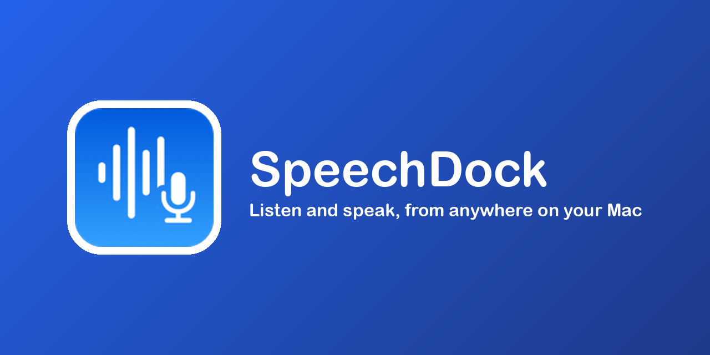

  

**macOSのTTS/STTを、より柔軟に、より使いやすく** — macOSには優れた音声認識・音声合成エンジンがありますが、手軽に活用する手段がありませんでした。SpeechDockがこの問題を解決します。

**メニューバーからいつでもアクセス可能** — グローバルホットキーでMacのどこからでもSTT/TTSを利用できます。マイク音声だけでなく、システム音声や特定アプリの音声も文字起こし可能。テキスト入力、貼り付け、画面からのOCRキャプチャなど、多様な方法でテキストを読み上げられます。

**インストール後すぐに使用可能** — APIキーや追加ダウンロードは不要です。macOS標準のSTT/TTSがすぐに動作します。クラウドプロバイダも利用可能です（オプション）。

[English](README.md) | 日本語

## ドキュメント

| | |
|---|---|
| **[基本機能](docs/index_ja.md)** | はじめに、macOSネイティブSTT/TTS、OCR、字幕、ショートカット |
| **[高度な機能](docs/advanced_ja.md)** | クラウドプロバイダ、APIキー、ファイル文字起こし、翻訳 |
| **[AppleScript自動化](docs/applescript_ja.md)** | スクリプトコマンド、プロパティ、例、エラーコード |

## 機能

### 音声認識（STT）

以下のプロバイダで音声をテキストに変換できます：

| プロバイダ | モデル | APIキー |
|----------|--------|---------|
| **macOS Native** | System Default（macOS 26+ではSpeechAnalyzer） | 不要 |
| **OpenAI** | GPT-4o Transcribe, GPT-4o Mini Transcribe, Whisper | 必要 |
| **Google Gemini** | Gemini 2.5 Flash, Gemini 2.0 Flash, Gemini 1.5 Pro | 必要 |
| **ElevenLabs** | Scribe v2 Realtime | 必要 |
| **Grok** | Grok Realtime | 必要 |

**注意**: macOS 26+では、ネイティブSTTはAppleの新しいSpeechAnalyzerフレームワークを使用し、時間制限なしのリアルタイム文字起こしと高いパフォーマンスを提供します。

### 音声合成（TTS）

以下のプロバイダでテキストを音声に変換できます：

| プロバイダ | モデル | APIキー |
|----------|--------|---------|
| **macOS Native** | System Default | 不要 |
| **OpenAI** | GPT-4o Mini TTS (Dec 2025), GPT-4o Mini TTS, TTS-1, TTS-1 HD | 必要 |
| **Google Gemini** | Gemini 2.5 Flash TTS, Gemini 2.5 Pro TTS | 必要 |
| **ElevenLabs** | Eleven v3, Flash v2.5, Multilingual v2, Turbo v2.5, Monolingual v1 | 必要 |
| **Grok** | Grok Voice | 必要 |

### OCR読み上げ

画面の任意の領域からテキストをキャプチャして音声に変換します：

1. OCRホットキー（デフォルト: `Ctrl + Option + Shift + O`）を押す
2. ドラッグしてテキストを含む領域を選択
3. 認識されたテキストがTTSパネルに表示され、編集可能
4. 読み上げボタンを押してテキストを音声で再生

macOS Vision Frameworkを使用してテキスト認識を行います。画面収録権限が必要です。

### 字幕モード

録音中にリアルタイム文字起こしを字幕オーバーレイとして表示します：

- **画面上の字幕** - 画面上の任意の場所にフローティング字幕として文字起こしを表示
- **リアルタイム翻訳** - 話しながら字幕を翻訳（オプション）
- **カスタマイズ可能な外観** - フォントサイズ、透明度、位置（上/下）、最大行数を調整可能
- **ドラッグ可能な位置** - 字幕を画面上の任意の位置にドラッグ可能
- **パネル自動非表示** - 字幕モード有効時にSTTパネルを自動的に非表示にするオプション

ホットキー（デフォルト: `Ctrl + Option + S`）またはSTTパネル/メニューバーから切り替えます。

### オーディオソース

- **マイク** - 接続されたマイクデバイスから録音（デバイス選択可能）
- **システムオーディオ** - Mac全体の音声出力をキャプチャ
- **アプリオーディオ** - 特定のアプリケーションの音声をキャプチャ

### クイック入力（フローティングマイクボタン）

STTパネルを開かずに音声入力を行うフローティングマイクボタン：

1. メニューバーから **Floating Mic Button** を有効化
2. ボタンをクリック、または `Ctrl + Option + M` で録音開始
3. 話す — リアルタイムで文字起こしがフローティングHUDに表示
4. 再度クリック、または `Ctrl + Option + M` で録音停止
5. 文字起こしテキストが最前面のアプリに自動ペースト

ボタンは画面上の任意の場所にドラッグでき、位置は保存されます。

### その他の機能

- STT/TTS用のグローバルキーボードショートカット
- モディファイアキー対応のカスタマイズ可能なパネルショートカット
- リアルタイム文字起こし用パネルウィンドウ（貼り付け先選択機能付き）
- TTS用パネルウィンドウ（テキスト編集・単語ハイライト機能付き）
- パネルスタイル選択: フローティング（最前面固定）または標準ウィンドウ
- TTS用オーディオ出力デバイス選択
- 合成音声のファイル保存（M4A/MP3形式）
- STT/TTS用言語選択
- TTS再生速度調整
- プロバイダごとの音声・モデル選択
- VAD（音声検出）による自動録音停止（ハンズフリー操作）
- STT出力のテキスト置換ルール
- Sparkleによる自動アップデート
- ログイン時に起動オプション

## 必要環境

- macOS 14.0（Sonoma）以降
- Apple Silicon Mac（M1/M2/M3/M4）
- クラウドプロバイダ用APIキーは**オプション**（OpenAI、Google Gemini、ElevenLabsを使用する場合のみ必要）

## インストール

1. [Releases](https://github.com/yohasebe/SpeechDock/releases)ページから最新の`.dmg`ファイルをダウンロード
2. DMGファイルを開く
3. SpeechDockをアプリケーションフォルダにドラッグ
4. アプリケーションからSpeechDockを起動

## セットアップ

### APIキー

クラウドプロバイダを使用するには、APIキーの設定が必要です：

1. **設定** > **API Keys** を開く
2. APIキーを入力：
   - **OpenAI**: [OpenAI Platform](https://platform.openai.com/api-keys)
   - **Google Gemini**: [Google AI Studio](https://aistudio.google.com/apikey)
   - **ElevenLabs**: [ElevenLabs Settings](https://elevenlabs.io/app/settings/api-keys)

APIキーはmacOSキーチェーンに安全に保存されます。

### 権限

SpeechDockには以下の権限が必要です：

| 権限 | 用途 |
|------|------|
| **マイク** | 音声認識の入力 |
| **アクセシビリティ** | グローバルショートカットとテキスト挿入 |
| **画面収録** | ウィンドウサムネイルとシステム/アプリオーディオキャプチャ |

**システム設定** > **プライバシーとセキュリティ** で権限を付与してください。初回使用時にプロンプトが表示されます。

## 使い方

### キーボードショートカット

| アクション | デフォルト |
|-----------|-----------|
| 録音開始/停止（STT） | `Cmd + Shift + Space` |
| 選択テキストを読み上げ（TTS） | `Ctrl + Option + T` |
| OCR領域を読み上げ | `Ctrl + Option + Shift + O` |
| 字幕モード切り替え | `Ctrl + Option + S` |
| クイック入力 | `Ctrl + Option + M` |

ショートカットは **設定** > **Shortcuts** でカスタマイズできます。

### STTパネル

| アクション | デフォルト |
|-----------|-----------|
| 録音 | `Cmd + R` |
| 録音停止 | `Cmd + S` |
| テキスト貼り付け | `Cmd + Return` |
| 貼り付け先選択 | `Cmd + Shift + Return` |
| キャンセル | `Cmd + .` |

### TTSパネル

| アクション | デフォルト |
|-----------|-----------|
| 読み上げ | `Cmd + Return` |
| 停止 | `Cmd + .` |
| 音声保存 | `Cmd + S` |

### メニューバー

メニューバーのSpeechDockアイコンをクリックして：

- STT録音の開始/停止
- 選択テキストのTTS開始
- オーディオ入力ソースとデバイスの選択
- オーディオ出力デバイスの選択
- プロバイダと設定の変更
- 設定へのアクセス

### オーディオ入力選択

**メニューバー** または **STTパネル** からオーディオ入力を選択：

- **マイク**: 利用可能なマイクデバイスから選択
- **システムオーディオ**: Mac全体の音声出力をキャプチャ
- **アプリオーディオ**: 実行中の特定アプリケーションの音声をキャプチャ

注: システムオーディオとアプリオーディオには画面収録権限が必要です。

### オーディオ出力選択

**設定**、**メニューバー**、**TTSパネル** からオーディオ出力デバイスを選択して、TTS再生を特定のスピーカーやヘッドフォンにルーティングできます。

## 設定

### 設定項目

- **General**: STT/TTSプロバイダ、モデル、音声、言語、再生速度、パネルスタイルの選択
- **Shortcuts**: グローバルホットキーとパネルショートカットのカスタマイズ
- **Text Replacement**: STT出力のテキスト自動修正・置換ルールの定義
- **API Keys**: クラウドプロバイダのAPIキー管理

### パネルスタイル

**設定** > **General** で2つのパネルスタイルから選択できます：

- **Floating**: 最前面固定のボーダーレスパネル。背景のどこでもドラッグ可能
- **Standard Window**: タイトルバー付きの通常のmacOSウィンドウ。最小化可能

注: STTパネルとTTSパネルは同時に開けません。一方を開くともう一方は自動的に閉じます。

### 言語選択

STTとTTSの両方で言語選択が可能です：

- **Auto**（デフォルト）: 言語を自動検出
- **手動選択**: 英語、日本語、中国語、韓国語、スペイン語、フランス語、ドイツ語、イタリア語、ポルトガル語、ロシア語、アラビア語、ヒンディー語から選択

### ログイン時に起動

**設定** > **General** で **Launch at Login** を有効にすると、SpeechDockが自動的に起動します。

## トラブルシューティング

### STTが動作しない

1. マイク権限が付与されているか確認
2. APIキーが設定されているか確認（クラウドプロバイダの場合）
3. macOS Nativeプロバイダで基本機能をテスト
4. システム/アプリオーディオの場合、画面収録権限を確認

### TTSが動作しない

1. APIキーが設定されているか確認（クラウドプロバイダの場合）
2. macOS Nativeプロバイダでテスト
3. オーディオ出力がミュートになっていないか確認
4. 別の出力デバイスを選択してみる

### ショートカットが反応しない

1. アクセシビリティ権限が付与されているか確認
2. 他のアプリケーションとの競合を確認
3. 設定でショートカットをデフォルトにリセット

### システムオーディオ/アプリオーディオが動作しない

1. システム設定で画面収録権限を付与
2. アプリオーディオの場合、対象アプリが実行中か確認
3. オーディオソースメニューからアプリリストを更新

### OCRが動作しない

1. システム設定で画面収録権限を付与
2. 選択した領域のテキストが鮮明で読みやすいか確認
3. テキスト周辺のより広い領域を選択してみる

## プライバシーとセキュリティ

- **APIキー**: macOSキーチェーンに安全に保存され、各プロバイダへの送信以外には使用されません
- **macOS Native**: 音声は完全にデバイス上で処理され、外部に送信されません
- **クラウドプロバイダ**: 音声はプロバイダのAPI（OpenAI、Google、ElevenLabs、Grok）に送信され、各社のプライバシーポリシーに従って処理されます
- **テレメトリなし**: SpeechDockは使用データの収集・送信を行いません

## ライセンス

Apache License 2.0 - 詳細は[LICENSE](LICENSE)を参照してください。

## 作者

長谷部陽一郎

## コントリビュート

コントリビュートを歓迎します！ガイドラインは[CONTRIBUTING.md](CONTRIBUTING.md)を参照してください。

開発者向け: ビルド手順と技術詳細は[DEVELOPMENT_NOTES_ja.md](DEVELOPMENT_NOTES_ja.md)を参照してください。
