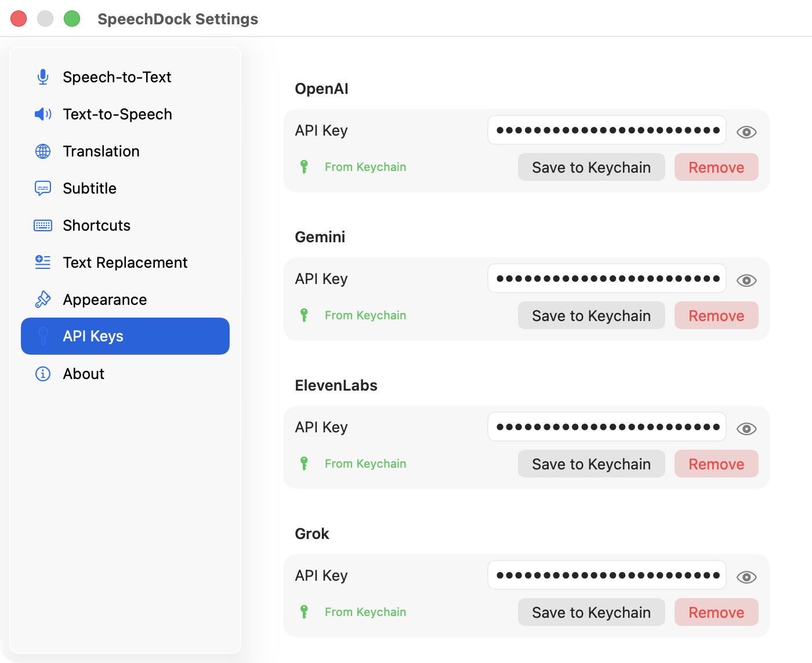
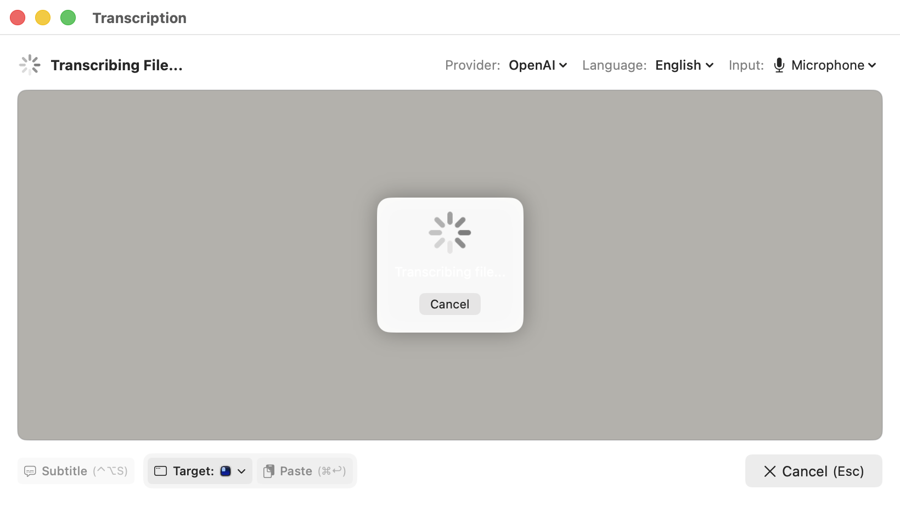

<a href="advanced_ja.html">日本語</a>

# SpeechDock — Advanced Features

This page covers features that require API keys from cloud providers. These are optional enhancements — SpeechDock works fully with macOS native STT/TTS without any API keys.

## API Key Setup

<figure>
  
  <figcaption>Settings — API Keys tab for configuring cloud provider credentials</figcaption>
</figure>

To use cloud providers, configure API keys in **Settings** > **API Keys**:

| Provider | Get API Key | Environment Variable |
|----------|-------------|---------------------|
| **OpenAI** | [OpenAI Platform](https://platform.openai.com/api-keys) | `OPENAI_API_KEY` |
| **Google Gemini** | [Google AI Studio](https://aistudio.google.com/apikey) | `GEMINI_API_KEY` |
| **ElevenLabs** | [ElevenLabs Settings](https://elevenlabs.io/app/settings/api-keys) | `ELEVENLABS_API_KEY` |
| **Grok (xAI)** | [xAI Console](https://console.x.ai/) | `GROK_API_KEY` |

API keys are securely stored in macOS Keychain. Alternatively, you can set environment variables for development.

## Cloud STT Providers

Cloud providers offer higher accuracy, more language support, and specialized features compared to macOS native STT.

| Provider | Models | Features |
|----------|--------|----------|
| **OpenAI** | GPT Realtime Whisper, GPT-4o Mini Transcribe, Whisper | Streaming deltas (Whisper), high accuracy, 100+ languages |
| **Google Gemini** | Gemini 2.5 Flash Native Audio, Gemini 3.1 Flash Live | Multimodal, fast |
| **ElevenLabs** | Scribe v2 Realtime | Low latency, natural punctuation |
| **Grok** | Grok STT | xAI's dedicated streaming speech-to-text |

Select the provider in **Settings** > **Speech-to-Text**.

## Cloud TTS Providers

Cloud TTS provides natural-sounding voices with various styles and languages.

| Provider | Models | Voices |
|----------|--------|--------|
| **OpenAI** | GPT-4o Mini TTS, TTS-1, TTS-1 HD | alloy, echo, fable, onyx, nova, shimmer |
| **Google Gemini** | Gemini 3.1 Flash TTS (Preview) | 30 multilingual voices (Zephyr, Kore, Puck, etc.) |
| **ElevenLabs** | Eleven v3, Eleven Flash v2.5 | Large voice library |
| **Grok** | Grok TTS | eve, ara, rex, sal, leo (20+ languages, auto-detected) |

### Voice Tags (Expressive Markup)

Some providers support inline voice tags that control delivery (laughter, whispers, pauses, etc.). Tags are typed directly in the TTS panel alongside the text.

| Provider | Inline tags | Wrapping tags | Example |
|----------|-------------|---------------|---------|
| **Gemini 3.1 Flash TTS** | `[whispers]`, `[excited]`, `[sighs]`, `[laughs]`, `[sarcastic]`, `[crying]`, `[tired]`, etc. | — | `Welcome! [excited] Let's go.` |
| **Grok TTS** | `[pause]`, `[long-pause]`, `[laugh]`, `[sigh]`, `[gulp]`, `[inhale]`, `[exhale]` | `<soft>`, `<loud>`, `<slow>`, `<fast>`, `<whisper>`, `<sing>` | `I have <whisper>a secret</whisper>.` |
| **ElevenLabs v3** | `[laughs]`, `[sighs]`, `[whispers]`, `[excited]`, `[tired]`, etc. | — | `That was hilarious! [laughs]` |

The empty-state TTS panel placeholder includes a "Reference" link to each provider's official tag documentation.

### Voice and Model Selection

Each provider offers different voices and models. Select them in:
- **Settings** > **Text-to-Speech** (persistent setting)
- **TTS Panel** header (quick switch)

### Audio Output Device

Route TTS playback to any audio output device (speakers, headphones, virtual devices). Select in **Settings** > **Text-to-Speech** or the TTS panel.

## Audio File Transcription

<figure>
  
  <figcaption>File Transcription — Drag and drop audio files to transcribe</figcaption>
</figure>

Transcribe pre-recorded audio files. Available with cloud STT providers and macOS native (macOS 26+). Not available with Grok provider.

| Provider | Formats | Max Size | Max Duration | API |
|----------|---------|----------|--------------|-----|
| **macOS** (26+) | MP3, WAV, M4A, AAC, AIFF, FLAC, MP4 | 500 MB | No limit | SpeechAnalyzer (offline) |
| **OpenAI** | MP3, WAV, M4A, FLAC, WebM, MP4 | 25 MB | Unlimited | Whisper |
| **Gemini** | MP3, WAV, AAC, OGG, FLAC | 20 MB | ~10 min | generateContent |
| **ElevenLabs** | MP3, WAV, M4A, OGG, FLAC | 25 MB | ~2 hours | Scribe v2 |

**Note**: macOS native file transcription requires macOS 26 or later and processes audio entirely on-device — no API key or internet connection needed.

### How to Transcribe

**Drag & Drop**: Drag an audio file onto the STT panel's text area.

**Menu Bar**: Select **Transcribe Audio File...** from the SpeechDock menu bar.

The STT panel placeholder displays the supported formats and limits for the currently selected provider.

## Translation with External Providers

While macOS on-device translation supports ~18 languages, cloud providers offer:
- 25+ languages (all languages in the language list)
- Higher translation quality using LLMs
- Works on macOS 14+ (no macOS 26 requirement)

### Translation Providers and Models

| Provider | Models | Notes |
|----------|--------|-------|
| **macOS** (default) | System | On-device, no API key, macOS 26+ |
| **OpenAI** | GPT-5 Nano (default), GPT-5 Mini, GPT-5.2 | Fast, high quality |
| **Gemini** | Gemini 3 Flash (default), Gemini 3 Pro | Fast, multilingual |
| **Grok** | Grok 3 Fast (default), Grok 3 Mini Fast | Fast translation |

### Switching Translation Provider

- **Settings** > **Translation**: Set the default provider and model
- **Panel**: Click the `⚡` button next to the translation controls for quick switching

### Provider Auto-Sync

When you switch STT or TTS providers, the translation provider automatically syncs:

| STT/TTS Provider | Translation Provider |
|------------------|---------------------|
| OpenAI | OpenAI |
| Gemini | Gemini |
| Grok | Grok |
| ElevenLabs / macOS | macOS |

## Subtitle Real-time Translation

When using subtitle mode, you can enable real-time translation that translates speech as you speak. This works with all audio sources (microphone, system audio, app audio).

### How It Works

1. Enable subtitle mode (`Ctrl + Option + S`)
2. Click the globe icon (🌐) in the subtitle header to enable translation
3. Select your target language and translation provider
4. Start recording — translations appear in real-time

### Translation Providers for Subtitles

| Provider | Debounce | Best For |
|----------|----------|----------|
| **macOS** | 300ms | Fast, local, privacy-focused |
| **OpenAI** | 800ms | High quality, many languages |
| **Gemini** | 600ms | Good balance of speed and quality |
| **Grok** | 800ms | Fast translation |

**Note**: Subtitle translation uses the provider's default model for optimal performance. This is independent of the model selected in the panel translation settings.

### Features

- **Caching** — Repeated phrases are translated instantly from cache (up to 200 entries)
- **Context-aware** — LLM providers use recent sentences as context for better translations
- **Pause detection** — Automatically triggers translation after 1.5 seconds of silence
- **Settings sync** — Translation settings sync from the STT panel when subtitle mode starts

### Limitations

- Translation adds some latency compared to transcription-only mode
- Cloud providers require API keys and internet connection
- macOS provider requires macOS 26+ and downloaded language packs

## Language Selection

Both STT and TTS support language selection with all cloud providers:

- **Auto** (default): Automatically detects the spoken/target language
- **Manual**: Choose from 25+ supported languages

Available languages: English, Japanese, Chinese, Korean, Spanish, French, German, Italian, Portuguese, Russian, Arabic, Hindi, Dutch, Polish, Turkish, Indonesian, Vietnamese, Thai, Bengali, Gujarati, Kannada, Malayalam, Marathi, Tamil, Telugu.

## TTS Speed Control (Save Audio)

When saving audio to a file, speed is controlled differently from real-time playback:

| Provider | Parameter | Range | Notes |
|----------|-----------|-------|-------|
| OpenAI | — | — | GPT-4o Mini TTS has no speed parameter; speed is applied locally during playback |
| ElevenLabs | `voice_settings.speed` | 0.7–1.2 | Mapped from app range |
| Gemini | — | — | Gemini 3.1 Flash TTS has no speed parameter; use `[pause]` or similar tags in text for pacing effects |
| macOS | Words per minute | 50–500 | Based on 175 wpm baseline |
| Grok | — | — | No speed parameter; wrap text with `<slow>...</slow>` or `<fast>...</fast>` for pacing |

For real-time playback, speed is controlled locally via audio processing for providers that support it, allowing dynamic adjustment during playback. Providers without an API speed parameter (OpenAI GPT-4o Mini TTS, Gemini 3.1, Grok TTS) disable the speed slider.

## Privacy Considerations

When using cloud providers:
- Audio data is sent to the respective provider's API for processing
- Each provider has its own privacy policy and data retention rules
- For maximum privacy, use macOS native providers (all processing on-device)
- API keys are stored in macOS Keychain and never shared between providers

---

**Previous**: [Basic Features](basics.md) | **Next**: [AppleScript Automation](applescript.md)
