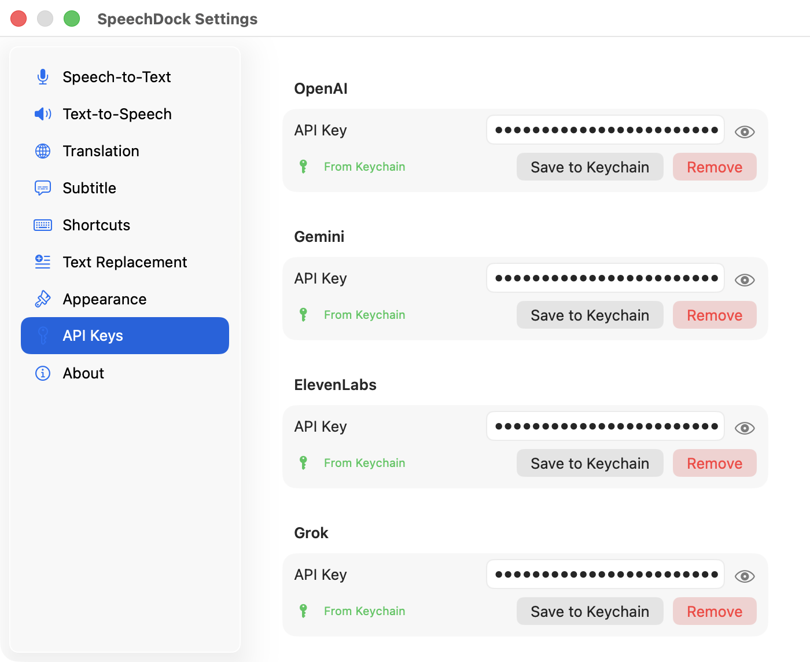

<a href="advanced.html">English</a>

# SpeechDock — 高度な機能

このページでは、クラウドプロバイダのAPIキーが必要な機能について説明します。これらはオプション機能です。SpeechDockはAPIキーなしでもmacOSネイティブのSTT/TTSで完全に動作します。

## APIキーの設定

<figure>
  
  <figcaption>設定 — クラウドプロバイダ認証情報のAPIキータブ</figcaption>
</figure>

クラウドプロバイダを使用するには、**設定** > **APIキー**でAPIキーを設定してください。

| プロバイダ | APIキーの取得 | 環境変数 |
|----------|-------------|---------------------|
| **OpenAI** | [OpenAI Platform](https://platform.openai.com/api-keys) | `OPENAI_API_KEY` |
| **Google Gemini** | [Google AI Studio](https://aistudio.google.com/apikey) | `GEMINI_API_KEY` |
| **ElevenLabs** | [ElevenLabs Settings](https://elevenlabs.io/app/settings/api-keys) | `ELEVENLABS_API_KEY` |
| **Grok (xAI)** | [xAI Console](https://console.x.ai/) | `GROK_API_KEY` |

APIキーはmacOSキーチェーンに安全に保存されます。開発時には環境変数を設定することもできます。

## クラウドSTTプロバイダ

クラウドプロバイダは、macOSネイティブSTTと比較して、より高い精度、より多くの言語サポート、特殊な機能を提供します。

| プロバイダ | モデル | 特徴 |
|----------|--------|----------|
| **OpenAI** | GPT-4o Transcribe、GPT-4o Mini Transcribe、Whisper | 高精度、100以上の言語 |
| **Google Gemini** | Gemini 2.5 Flash Native Audio、Gemini 2.0 Flash Live | マルチモーダル、高速 |
| **ElevenLabs** | Scribe v2 Realtime | 低遅延、自然な句読点 |
| **Grok** | Grok 2 | xAIのリアルタイム文字起こし |

プロバイダは**設定** > **音声認識**から選択できます。

## クラウドTTSプロバイダ

クラウドTTSは、さまざまなスタイルと言語で自然な音声を提供します。

| プロバイダ | モデル | 音声 |
|----------|--------|--------|
| **OpenAI** | GPT-4o Mini TTS、TTS-1、TTS-1 HD | alloy、echo、fable、onyx、nova、shimmer |
| **Google Gemini** | Gemini 2.5 Flash TTS、Gemini 2.5 Pro TTS | 多言語音声 |
| **ElevenLabs** | Eleven v3、Eleven Flash v2.5、Eleven Multilingual v2、Eleven Turbo v2.5 | 豊富な音声ライブラリ |
| **Grok** | Grok 2 | Clio、Sage、Charon、Fenrir、Leda |

### 音声とモデルの選択

各プロバイダは異なる音声とモデルを提供しています。以下から選択できます：
- **設定** > **音声合成**（永続的な設定）
- **TTSパネル**のヘッダー（クイック切り替え）

### 音声出力デバイス

TTS再生を任意の音声出力デバイス（スピーカー、ヘッドフォン、仮想デバイス）にルーティングできます。**設定** > **音声合成**またはTTSパネルから選択してください。

## 音声ファイルの文字起こし

<figure>
  
  <figcaption>ファイル文字起こし — 音声ファイルをドラッグ＆ドロップして文字起こし</figcaption>
</figure>

録音済みの音声ファイルを文字起こしできます。クラウドSTTプロバイダとmacOSネイティブ（macOS 26+）で利用可能です。Grokプロバイダでは利用できません。

| プロバイダ | 形式 | 最大サイズ | 最大長 | API |
|----------|---------|----------|--------------|-----|
| **macOS**（26+） | MP3、WAV、M4A、AAC、AIFF、FLAC、MP4 | 500 MB | 無制限 | SpeechAnalyzer（オフライン） |
| **OpenAI** | MP3、WAV、M4A、FLAC、WebM、MP4 | 25 MB | 無制限 | Whisper |
| **Gemini** | MP3、WAV、AAC、OGG、FLAC | 20 MB | 約10分 | generateContent |
| **ElevenLabs** | MP3、WAV、M4A、OGG、FLAC | 25 MB | 約2時間 | Scribe v2 |

**注意**: macOSネイティブのファイル文字起こしにはmacOS 26以降が必要です。音声はすべてデバイス上で処理され、APIキーやインターネット接続は不要です。

### 文字起こしの方法

**ドラッグ＆ドロップ**: 音声ファイルをSTTパネルのテキストエリアにドラッグします。

**メニューバー**: SpeechDockメニューバーから**Transcribe Audio File...**を選択します。

STTパネルのプレースホルダーには、現在選択されているプロバイダがサポートする形式と制限が表示されます。

## 外部プロバイダによる翻訳

macOSのオンデバイス翻訳は約18言語をサポートしていますが、クラウドプロバイダでは以下が可能です：
- 25以上の言語（言語リストのすべての言語）
- LLMを使用した高品質な翻訳
- macOS 14以降で動作（macOS 26の要件なし）

### 翻訳プロバイダとモデル

| プロバイダ | モデル | 備考 |
|----------|--------|-------|
| **macOS**（デフォルト） | System | オンデバイス、APIキー不要、macOS 26以降 |
| **OpenAI** | GPT-5 Nano（デフォルト）、GPT-5 Mini、GPT-5.2 | 高速、高品質 |
| **Gemini** | Gemini 3 Flash（デフォルト）、Gemini 3 Pro | 高速、多言語対応 |
| **Grok** | Grok 3 Fast（デフォルト）、Grok 3 Mini Fast | 高速翻訳 |

### 翻訳プロバイダの切り替え

- **設定** > **翻訳**: デフォルトのプロバイダとモデルを設定
- **パネル**: 翻訳コントロールの横にある`⚡`ボタンをクリックしてクイック切り替え

### プロバイダの自動同期

STTまたはTTSプロバイダを切り替えると、翻訳プロバイダが自動的に同期されます：

| STT/TTSプロバイダ | 翻訳プロバイダ |
|------------------|---------------------|
| OpenAI | OpenAI |
| Gemini | Gemini |
| Grok | Grok |
| ElevenLabs / macOS | macOS |

## 字幕リアルタイム翻訳

字幕モードを使用すると、話しながらリアルタイムで翻訳できます。これはすべての音声ソース（マイク、システム音声、アプリ音声）で動作します。

### 動作の仕組み

1. 字幕モードを有効化（`Ctrl + Option + S`）
2. 字幕ヘッダーの地球儀アイコン（🌐）をクリックして翻訳を有効化
3. ターゲット言語と翻訳プロバイダを選択
4. 録音を開始 — 翻訳がリアルタイムで表示される

### 字幕用翻訳プロバイダ

| プロバイダ | デバウンス | 最適な用途 |
|----------|----------|----------|
| **macOS** | 300ms | 高速、ローカル、プライバシー重視 |
| **OpenAI** | 800ms | 高品質、多言語対応 |
| **Gemini** | 600ms | 速度と品質のバランス |
| **Grok** | 800ms | 高速翻訳 |

**注意**: 字幕翻訳は最適なパフォーマンスのためにプロバイダのデフォルトモデルを使用します。これはパネル翻訳設定で選択されたモデルとは独立しています。

### 機能

- **キャッシュ** — 繰り返されるフレーズはキャッシュから即座に翻訳（最大200エントリ）
- **コンテキスト対応** — LLMプロバイダはより良い翻訳のために最近の文章をコンテキストとして使用
- **ポーズ検出** — 1.5秒の無音後に自動的に翻訳をトリガー
- **設定同期** — 字幕モード開始時にSTTパネルから翻訳設定を同期

### 制限事項

- 翻訳は文字起こしのみのモードと比較していくらかの遅延を追加
- クラウドプロバイダはAPIキーとインターネット接続が必要
- macOSプロバイダはmacOS 26以降とダウンロード済みの言語パックが必要

## 言語の選択

STTとTTSの両方で、すべてのクラウドプロバイダで言語選択がサポートされています：

- **自動**（デフォルト）: 話されている言語/対象言語を自動検出
- **手動**: 25以上のサポート言語から選択

対応言語: 英語、日本語、中国語、韓国語、スペイン語、フランス語、ドイツ語、イタリア語、ポルトガル語、ロシア語、アラビア語、ヒンディー語、オランダ語、ポーランド語、トルコ語、インドネシア語、ベトナム語、タイ語、ベンガル語、グジャラート語、カンナダ語、マラヤーラム語、マラーティー語、タミル語、テルグ語。

## TTS速度制御（音声保存）

ファイルに音声を保存する際、速度はリアルタイム再生とは異なる方法で制御されます：

| プロバイダ | パラメータ | 範囲 | 備考 |
|----------|-----------|-------|-------|
| OpenAI | `speed` | 0.25〜4.0 | TTS-1/TTS-1 HDのみ |
| ElevenLabs | `voice_settings.speed` | 0.7〜1.2 | アプリの範囲からマッピング |
| Gemini | テキスト指示 | なし | 自然言語によるペース指示 |
| macOS | 1分あたりの単語数 | 50〜500 | 基準175 wpm |
| Grok | — | — | 速度パラメータ非対応 |

リアルタイム再生では、速度は常にオーディオ処理によってローカルで制御され、再生中に動的に調整できます。

## プライバシーに関する考慮事項

クラウドプロバイダを使用する場合：
- 音声データは処理のために各プロバイダのAPIに送信されます
- 各プロバイダには独自のプライバシーポリシーとデータ保持規則があります
- 最大限のプライバシーを確保するには、macOSネイティブプロバイダを使用してください（すべての処理がデバイス上で行われます）
- APIキーはmacOSキーチェーンに保存され、プロバイダ間で共有されることはありません

---

**前へ**: [基本機能](basics_ja.md) | **次へ**: [AppleScript自動化](applescript_ja.md)
