
<a href="basics_ja.html">日本語</a>

# SpeechDock — Basic Features

SpeechDock makes macOS TTS/STT more flexible and accessible. While macOS includes powerful speech recognition and synthesis engines, there's no convenient way to use them. SpeechDock fills this gap — a menu bar application that makes TTS and STT accessible from anywhere on your Mac.

It works immediately after installation with no API keys or additional downloads required.

## Installation

1. Download the latest `.dmg` file from the [Releases](https://github.com/yohasebe/SpeechDock/releases) page
2. Open the DMG file and drag SpeechDock to your Applications folder
3. Launch SpeechDock from Applications

### Requirements

- macOS 14.0 (Sonoma) or later
- Apple Silicon Mac (M1/M2/M3/M4)

### Permissions

SpeechDock requires or recommends the following permissions:

| Permission | Level | Purpose |
|------------|-------|---------|
| **Microphone** | Required | Speech recognition input |
| **Accessibility** | Recommended | Global keyboard shortcuts and text insertion |
| **Screen Recording** | Optional | System/App Audio capture, OCR, and window thumbnails |

On first launch, SpeechDock displays a permission setup window with real-time status indicators. Grant permissions in **System Settings** > **Privacy & Security** — the setup window updates automatically without restarting the app. Features that require missing permissions are disabled in the UI with clear visual indicators.

## Speech-to-Text (STT)

<figure>
  
  <figcaption>STT Panel — Real-time speech recognition with multiple audio sources</figcaption>
</figure>

Convert speech to text using the built-in macOS speech recognition engine. No API keys required.

- On macOS 14–15: Uses Apple's SFSpeechRecognizer (auto-restarts at 60-second intervals)
- On macOS 26+: Uses SpeechAnalyzer framework (no time limits, improved accuracy)

### Audio Sources

| Source | Description | Requirement |
|--------|-------------|-------------|
| **Microphone** | Record from any connected microphone | Microphone permission |
| **System Audio** | Capture all audio output from your Mac | Screen Recording permission |
| **App Audio** | Capture audio from a specific application | Screen Recording permission |

### STT Panel

Open the STT panel with the global hotkey (default: `Cmd + Shift + Space`), or from the menu bar.

| Action | Shortcut |
|--------|----------|
| Record / Stop | `Cmd + R` / `Cmd + S` |
| Paste to Target | `Cmd + Return` |
| Select Paste Target | `Cmd + Shift + Return` |
| Cancel | `Cmd + .` |

<figure>
  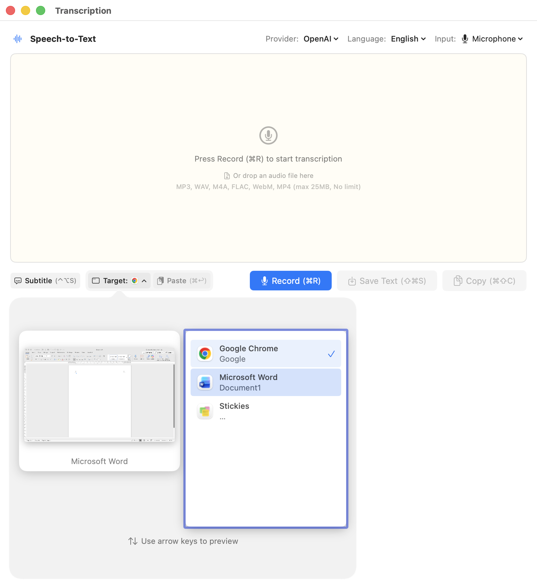
  <figcaption>Select Paste Target — Choose which application receives the transcribed text</figcaption>
</figure>

**Auto-start Recording**: When enabled in Settings, the STT panel starts recording immediately when opened.

### VAD (Voice Activity Detection)

Automatically stops recording when silence is detected:

- **Minimum recording time**: How long to record before VAD activates (default: 10 seconds)
- **Silence duration**: How long silence lasts before stopping (default: 3 seconds)

Configure in **Settings** > **Speech-to-Text**.

## Text-to-Speech (TTS)

<figure>
  
  <figcaption>TTS Panel — Text-to-speech with speed control and audio saving</figcaption>
</figure>

Convert text to speech using the built-in macOS speech synthesis. No API keys required.

### TTS Panel

Open the TTS panel with the global hotkey (default: `Ctrl + Option + T`), or from the menu bar.

| Action | Shortcut |
|--------|----------|
| Speak / Stop | `Cmd + Return` / `Cmd + .` |
| Save Audio | `Cmd + S` |

**Input methods**:
- Type text directly in the panel
- Select text in another app, then press the TTS hotkey (auto-captures selected text)
- Use OCR to capture text from the screen

**Auto-speak**: When enabled, automatically starts speaking the captured text when the panel opens.

### Speed Control

Adjust playback speed from 0.5x to 2.0x using the slider in the TTS panel. Speed changes apply in real-time during playback.

### Save Audio

Save synthesized audio to a file by pressing `Cmd + S` or clicking the Save button. The text must be at least 5 characters long.

## OCR to Speech

<figure>
  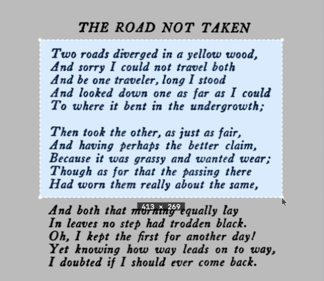
  <figcaption>OCR Selection — Drag to select a screen region for text recognition</figcaption>
</figure>

Capture text from any screen region and send it to the TTS panel:

1. Press the OCR hotkey (default: `Ctrl + Option + Shift + O`)
2. Drag to select the region containing text
3. Recognized text appears in the TTS panel
4. Edit if needed, then press Speak

Uses the macOS Vision Framework for text recognition.

## Subtitle Mode

<figure>
  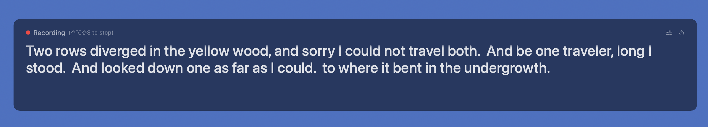
  <figcaption>Subtitle Overlay — Real-time transcription displayed as floating subtitles</figcaption>
</figure>

Display real-time transcription as a floating subtitle overlay:

- **Floating subtitles** — Appears on top of all windows
- **Click-through** — Doesn't interfere with your work
- **Customizable** — Font size, opacity, max lines, position
- **Draggable** — Position anywhere on screen
- **Real-time translation** — Optionally translate subtitles as you speak

Toggle with hotkey (default: `Ctrl + Option + S`), from the STT panel, or from the menu bar.

Subtitles show only the current recording session's transcription. Previous sessions are not displayed.

### Subtitle Translation

Enable real-time translation directly in the subtitle overlay:

1. Click the globe icon (🌐) in the subtitle header to enable translation
2. Select target language and provider from the dropdown menus
3. Translated text appears below the original transcription

Translation settings are synced from the STT panel when subtitle mode starts. You can change them independently in the subtitle overlay.

## Quick Transcription

<figure>
  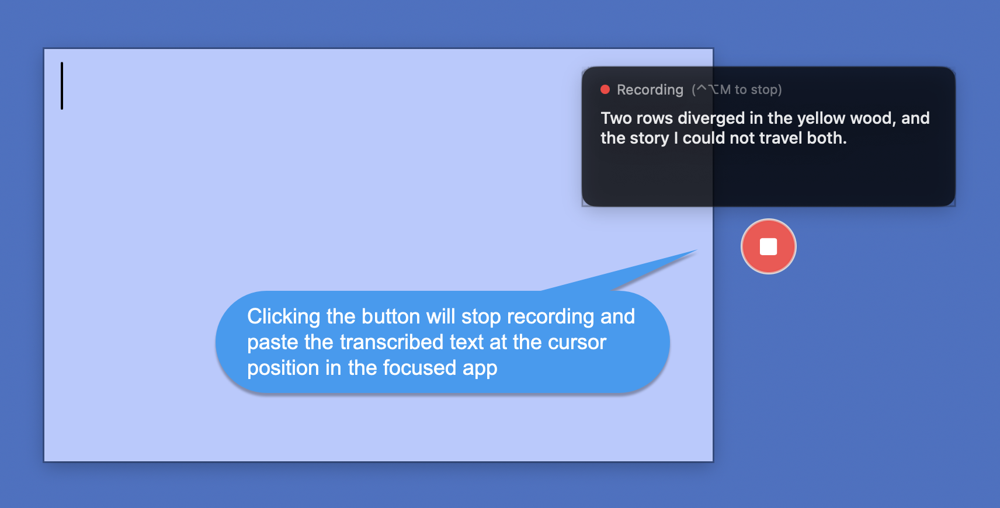
  <figcaption>Quick Transcription — Clicking the button stops recording and pastes the transcribed text at the cursor</figcaption>
</figure>

A floating microphone button for instant voice input without opening the STT panel. Perfect for quick dictation into any application.

### How to Use

1. Enable **Floating Mic Button** from the menu bar
2. Click the button or press `Ctrl + Option + M` to start recording
3. Speak — real-time transcription appears in a floating HUD next to the button
4. Click again or press `Ctrl + Option + M` to stop
5. Transcribed text is automatically pasted into the frontmost app

### Features

- **Floating button** — 48px round button, always visible on screen
- **Draggable** — Drag to any position; position is saved between sessions
- **Real-time HUD** — Shows transcription text as you speak
- **Auto-paste** — Transcribed text is pasted when recording stops
- **Context menu** — Right-click to switch STT provider or hide the button

### Button States

| State | Appearance |
|-------|------------|
| Idle | Gray button with mic icon |
| Hover | Accent color |
| Recording | Red with pulse animation, stop icon |

The button tooltip shows the current shortcut and recording duration.

## Translation

<figure>
  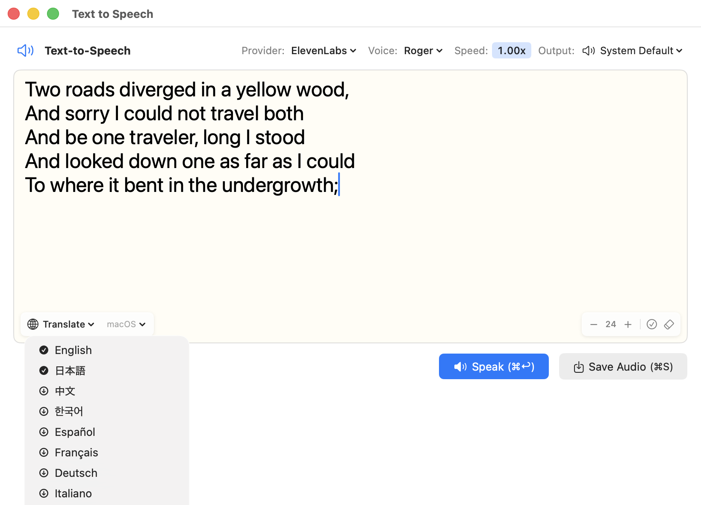
  <figcaption>Translation Controls — Translate text with one click</figcaption>
</figure>

Translate transcribed or TTS text using macOS on-device translation (macOS 26+ required). No API keys needed; supports approximately 18 languages.

### How to Use

1. Enter or transcribe text in the STT or TTS panel
2. Select the target language from the language dropdown (e.g., `→ Japanese ▼`)
3. Click `[🌐 Translate]` to translate the text
4. Click `[🌐 Original ◀]` to revert to the original text

The translation controls appear when text is 3 or more characters and no recording/speaking is in progress. Language selection and translation execution are separate actions, so you can change the target language without triggering translation.

**TTS Language Sync**: When you translate text, the TTS language automatically switches to match the translation target. Reverting to the original restores the previous TTS language.

For more translation options (100+ languages, higher quality), see [Advanced Features](advanced.md#translation-with-external-providers).

## Text Replacement

Define rules to automatically correct or replace patterns in STT output or TTS input.

### Built-in Patterns

| Pattern | Example | Default Replacement |
|---------|---------|---------------------|
| URLs | `https://example.com` | " URL " |
| Email | `user@example.com` | " Email " |
| File Paths | `/path/to/file` | " Path " |

Each pattern can be toggled on/off with customizable replacement text.

### Custom Rules

Add your own regex-based replacement rules in **Settings** > **Text Replacement**. Rules can be exported/imported as JSON files.

In the TTS panel, matched text is highlighted with an orange underline and tooltip.

## Keyboard Shortcuts

### Global Hotkeys

| Action | Default |
|--------|---------|
| Toggle STT Panel | `Cmd + Shift + Space` |
| Toggle TTS Panel | `Ctrl + Option + T` |
| OCR Region to Speech | `Ctrl + Option + Shift + O` |
| Toggle Subtitle Mode | `Ctrl + Option + S` |
| Quick Transcription | `Ctrl + Option + M` |

Customize in **Settings** > **Shortcuts**.

Press `?` in any panel to display the keyboard shortcuts cheat sheet:

<figure>
  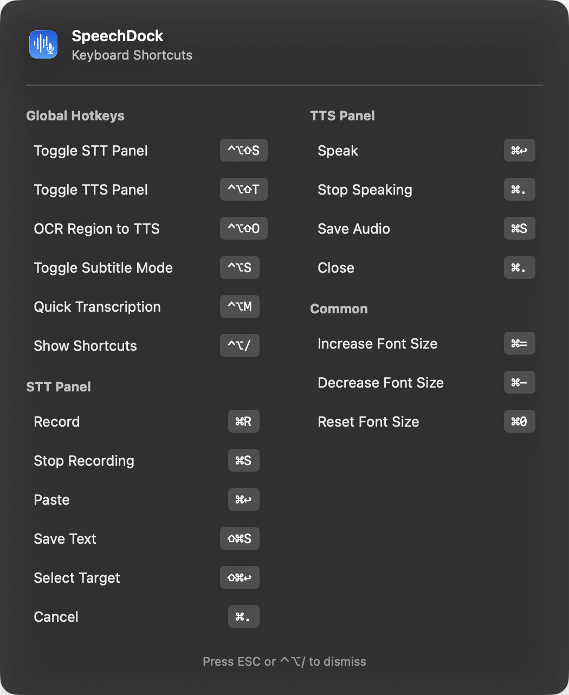
  <figcaption>Keyboard Shortcuts Cheat Sheet</figcaption>
</figure>

### Panel Shortcuts

Panel shortcuts can be customized with modifier key support in **Settings** > **Shortcuts**.

## Panel Style

Choose in **Settings** > **Appearance**:

- **Floating** — Always-on-top borderless panel, draggable from anywhere
- **Standard Window** — Regular macOS window with title bar

Only one panel (STT or TTS) can be open at a time. Opening one closes the other.

## Menu Bar

<figure>
  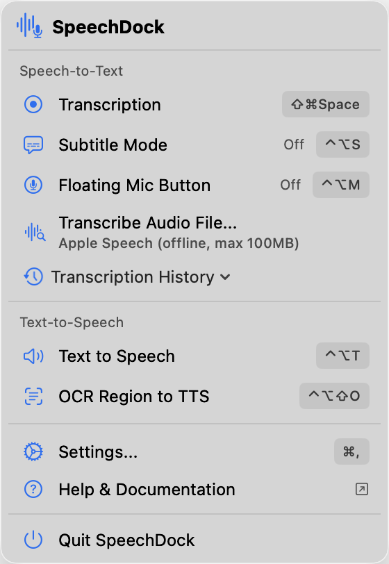
  <figcaption>Menu Bar — Quick access to all features</figcaption>
</figure>

Click the SpeechDock icon in the menu bar for quick access to:

- Start/stop STT recording
- Open TTS for selected text
- Toggle subtitle mode and floating mic button
- Transcribe audio files
- Open transcription history
- OCR to speech
- Access Settings, Help, and About

## Settings

Open Settings with `Cmd + ,` or from the menu bar. The unified settings window uses a sidebar with the following categories:

<figure>
  
  <figcaption>Speech-to-Text — Provider, model, language, audio input, auto-stop, panel behavior</figcaption>
</figure>

<figure>
  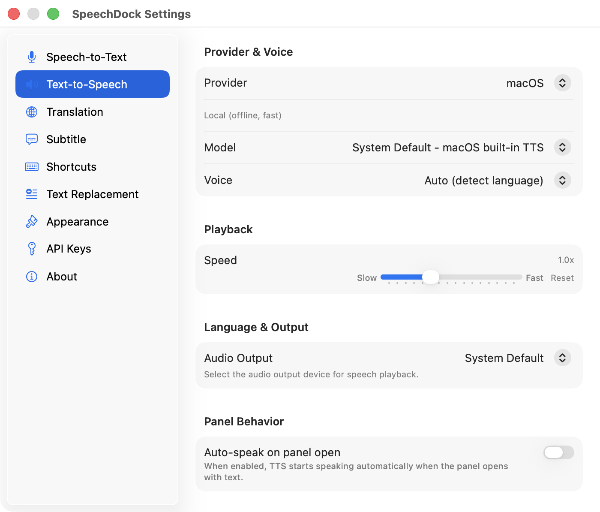
  <figcaption>Text-to-Speech — Provider, model, voice, speed, audio output, panel behavior</figcaption>
</figure>

<figure>
  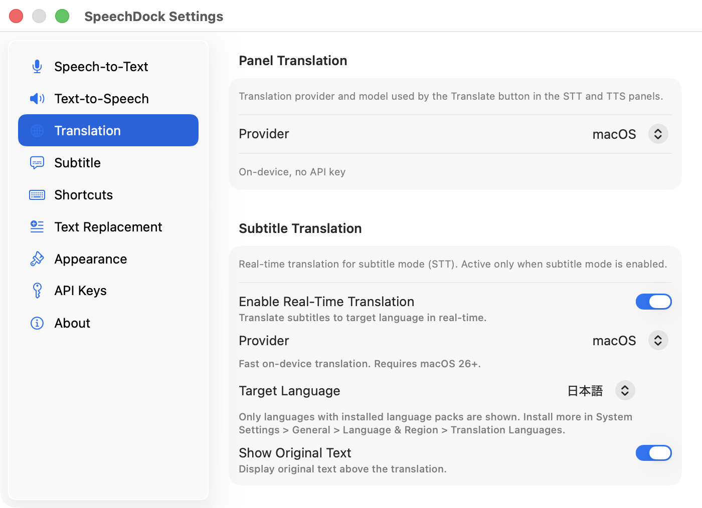
  <figcaption>Translation — Panel translation provider/model, subtitle translation settings</figcaption>
</figure>

<figure>
  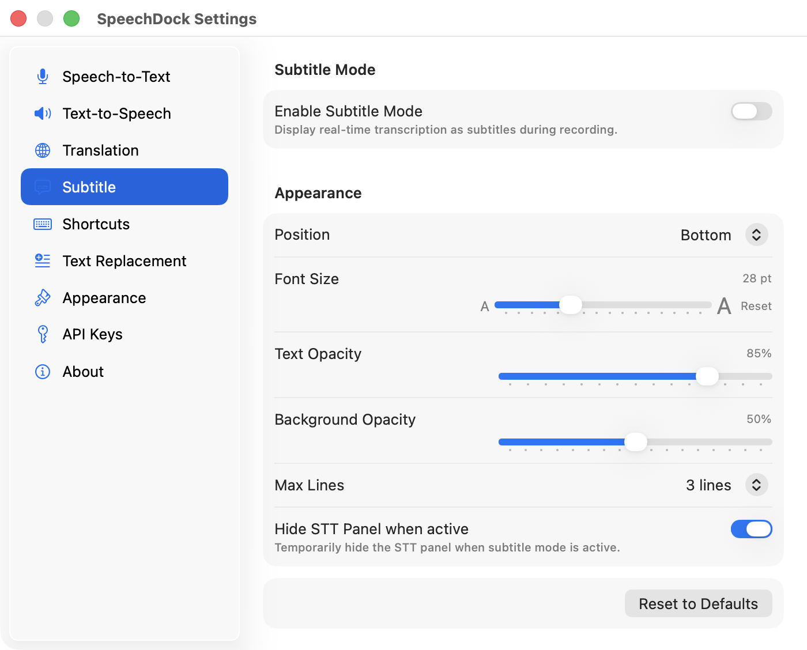
  <figcaption>Subtitle — On/off, position, font size, text/background opacity, max lines</figcaption>
</figure>

<figure>
  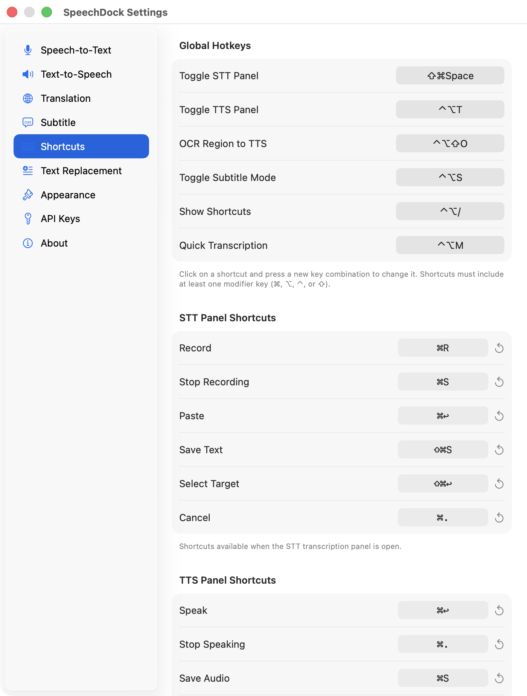
  <figcaption>Shortcuts — Global hotkeys and panel shortcuts</figcaption>
</figure>

<figure>
  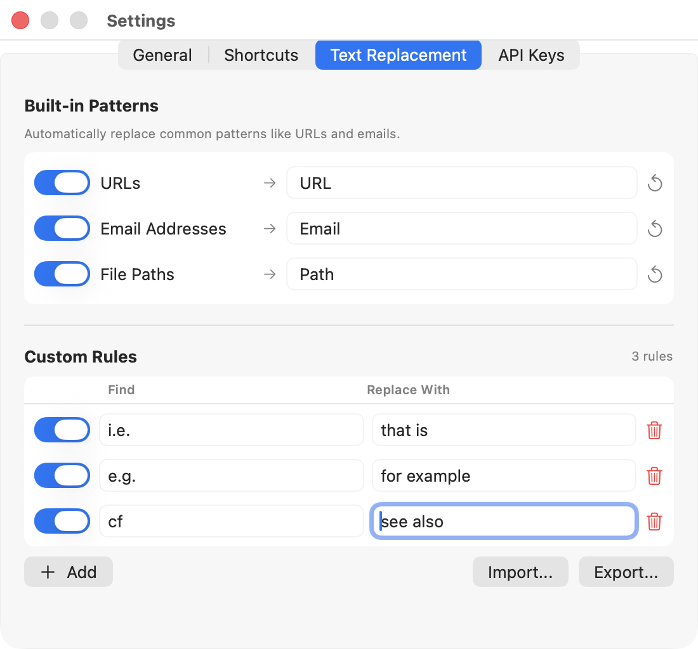
  <figcaption>Text Replacement — Built-in patterns and custom rules</figcaption>
</figure>

<figure>
  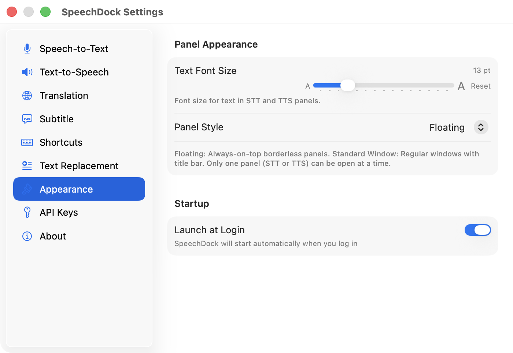
  <figcaption>Appearance — Text font size, panel style, launch at login</figcaption>
</figure>

For API key settings, see [Advanced Features](advanced.html).

## Privacy & Security

- **macOS Native**: All audio processed on-device. No data sent externally.
- **API Keys**: Stored in macOS Keychain, never transmitted except to the respective provider.
- **No Telemetry**: SpeechDock does not collect or transmit usage data.

## Troubleshooting

### STT not working

1. Check Microphone permission is granted
2. For System/App Audio, check Screen Recording permission
3. Try restarting the app

### TTS not working

1. Check audio output is not muted
2. Try selecting a different output device
3. Try restarting the app

### Shortcuts not responding

1. Check Accessibility permission is granted
2. Look for conflicts with other applications
3. Reset shortcuts to defaults in Settings

### OCR not working

1. Check Screen Recording permission is granted
2. Try selecting a larger region with clearer text

---

**Previous**: [Home](index.md) | **Next**: [Advanced Features](advanced.md)
