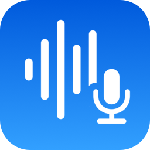
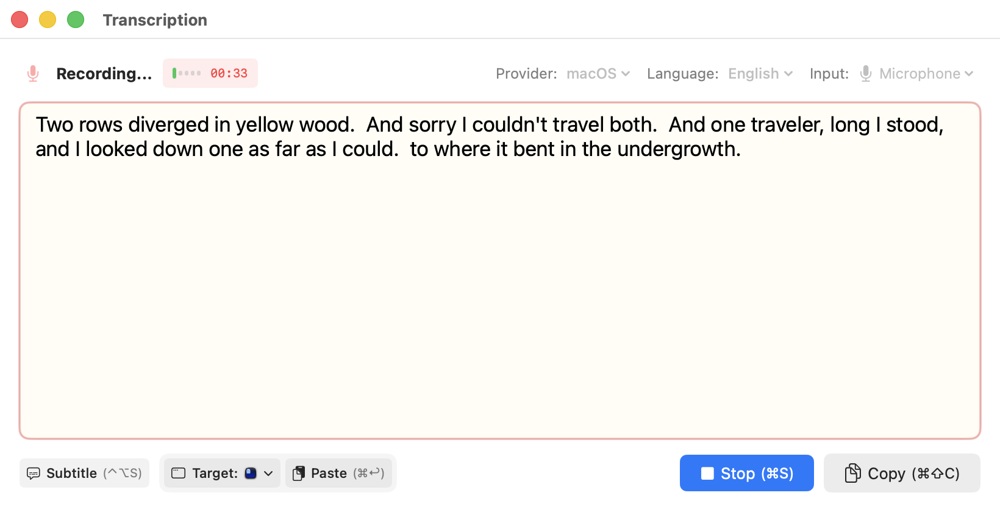
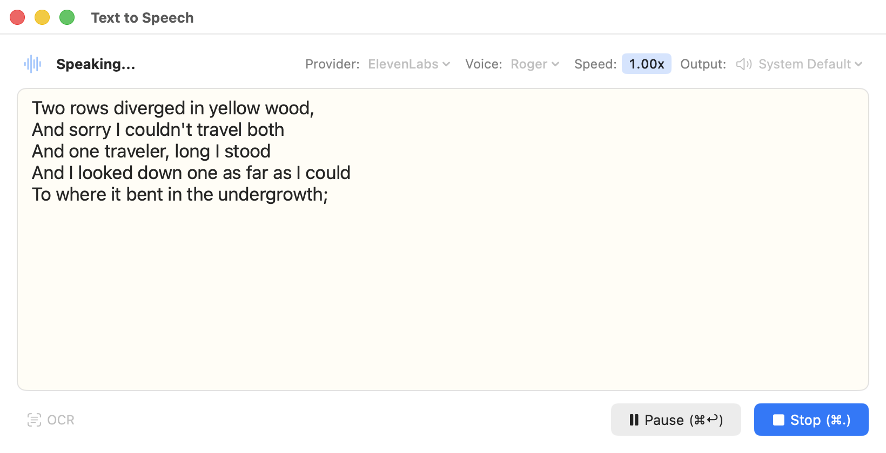

<a href="index_ja.html">日本語</a>

  

# SpeechDock
{: .text-center }

**A macOS menu bar app for Speech-to-Text and Text-to-Speech**
{: .text-center .fs-6 }

[Download](https://github.com/yohasebe/SpeechDock/releases){: .btn .btn-primary .mr-2 }
[View on GitHub](https://github.com/yohasebe/SpeechDock){: .btn }
{: .text-center }

---

## What is SpeechDock?

SpeechDock makes macOS TTS/STT more flexible and accessible. While macOS includes powerful speech recognition and synthesis engines, there's no convenient way to use them. SpeechDock fills this gap — a menu bar application that makes TTS and STT accessible from anywhere on your Mac.

**Works immediately after installation** — no API keys or additional downloads required.

---

## Key Features

### Speech-to-Text (STT)
- **Multiple audio sources** — Microphone, System Audio, or specific App Audio
- **Real-time transcription** — See text as you speak
- **Subtitle mode** — Floating overlay for presentations and meetings
- **Quick transcription** — Floating mic button for instant dictation

### Text-to-Speech (TTS)
- **Natural voices** — Use macOS built-in or cloud provider voices
- **Speed control** — Adjust playback speed in real-time (0.5x to 2.0x)
- **OCR to speech** — Capture and read text from any screen region
- **Save audio** — Export speech to audio files

### Translation
- **On-device translation** — No API keys required (macOS 26+)
- **18+ languages** — Translate between major languages
- **TTS integration** — Automatically read translated text

### Cloud Providers (Optional)
- **OpenAI** — GPT-4o Transcribe, GPT-4o Mini TTS
- **Google Gemini** — Gemini 2.5 Flash (STT/TTS)
- **ElevenLabs** — Scribe v2 (STT), Eleven v3 (TTS)
- **Grok (xAI)** — Grok 2 (STT/TTS)

---

## Requirements

- macOS 14.0 (Sonoma) or later
- Apple Silicon Mac (M1/M2/M3/M4)

---

## Documentation

| Page | Description |
|:-----|:------------|
| [Basic Features](basics.html) | Installation, STT, TTS, OCR, Subtitles, Shortcuts |
| [Advanced Features](advanced.html) | Cloud providers, API keys, File transcription |
| [AppleScript](applescript.html) | Automation and scripting |

---

## Screenshots

<figure>
  
  <figcaption>Speech-to-Text Panel</figcaption>
</figure>

<figure>
  
  <figcaption>Text-to-Speech Panel</figcaption>
</figure>

---

## License

SpeechDock is released under the [Apache License 2.0](https://github.com/yohasebe/SpeechDock/blob/main/LICENSE).
